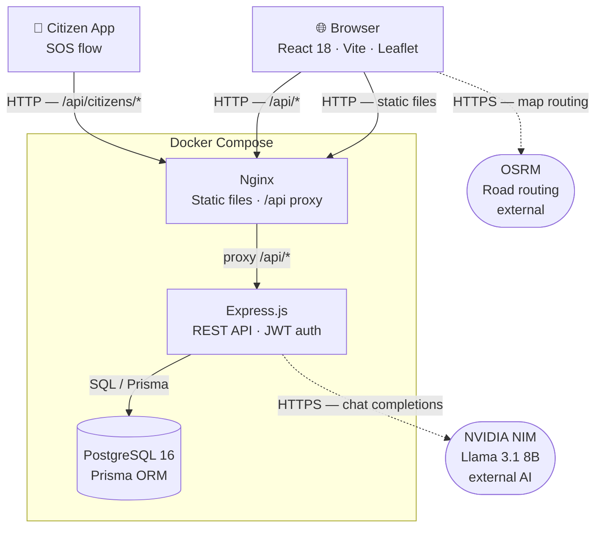
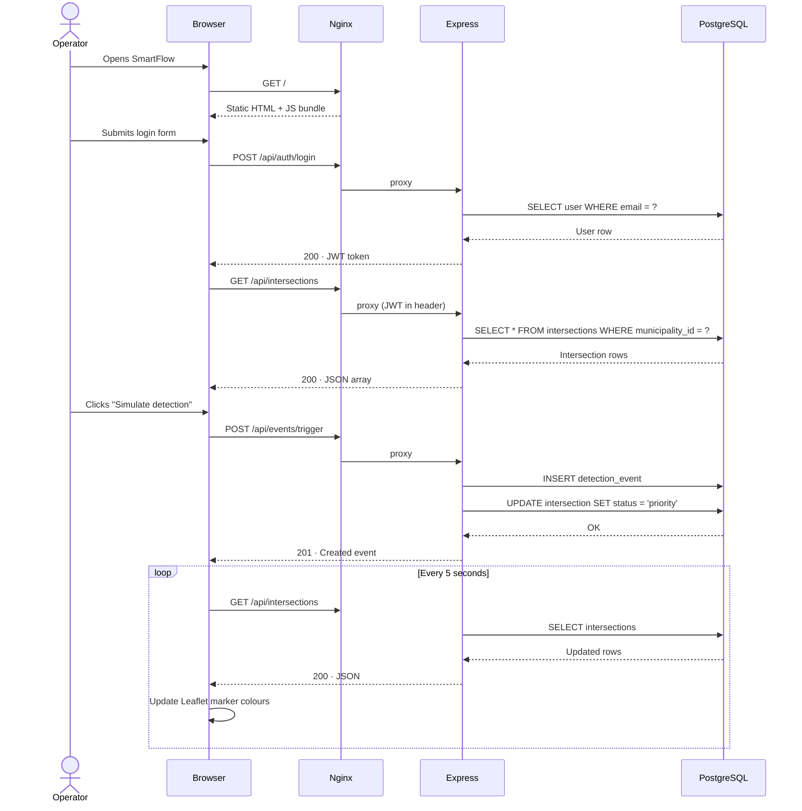
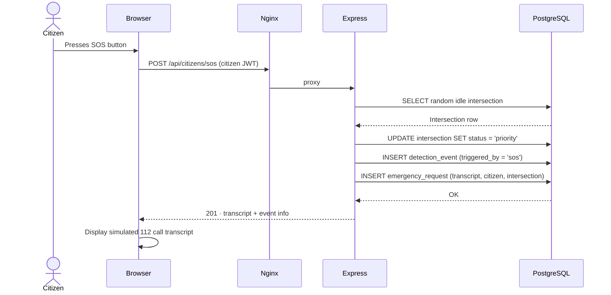

# Architecture — SmartFlow

> **Project II · Web Programming · ETIC_Algarve · 2025/26**

---

## System Architecture Diagram



---

## Data Flow

### Operator detection flow



### Citizen SOS flow



---

## Services

### `frontend` — Nginx (`nginx:alpine`)

Serves the compiled Vite/React bundle — HTML, JS chunks, CSS, fonts — and acts as a **reverse proxy** for all API requests. A single-origin setup means the browser never has to deal with CORS.

**Responsibilities:**
- Serve the static build output (HTML, JS, CSS, web fonts)
- Proxy all `/api/*` requests to the `backend` service
- `try_files $uri /index.html` fallback for client-side routing

**Key config:** [frontend/nginx.conf](../frontend/nginx.conf)

---

### `backend` — Node.js 20 (`node:20-alpine`)

Express.js REST API. On startup it runs `prisma migrate deploy` to apply pending migrations before accepting requests.

**Responsibilities:**

| Route prefix | Purpose | Auth |
|---|---|---|
| `POST /api/auth/login` | Issue JWT tokens | None |
| `GET /api/municipalities` | List municipalities | None |
| `GET|POST|PUT|DELETE /api/intersections` | Intersection CRUD (scoped to municipality) | Operator JWT |
| `GET /api/events` | List detection events | Operator JWT |
| `POST /api/events/trigger` | Manual detection trigger | Operator JWT |
| `POST /api/events/:id/resolve` | Close an active event | Operator JWT |
| `/api/admin/*` | SuperAdmin: manage municipalities, approve intersections, view global history | SuperAdmin JWT |
| `/api/citizens/*` | Citizen registration, login, profile, SOS | Citizen JWT (separate claim) |
| `POST /api/chat` | AI support chat via NVIDIA NIM | None (rate-limited) |

**Key files:** [backend/src/index.js](../backend/src/index.js), [backend/src/routes/](../backend/src/routes/), [backend/src/middleware/auth.js](../backend/src/middleware/auth.js)

---

### `db` — PostgreSQL 16 (`postgres:16-alpine`)

Relational database. Data is persisted in a named Docker volume (`pgdata`) so it survives container restarts. A `pg_isready` healthcheck ensures the backend waits for a healthy database before starting.

**Schema managed by:** Prisma — [backend/prisma/schema.prisma](../backend/prisma/schema.prisma)

---

### OSRM — External

The open-source routing engine used by the Leaflet map to draw road-following ambulance routes from an intersection to a citizen's location. Calls are made directly from the browser to `router.project-osrm.org`.

> **Note:** OSRM is a public third-party service. If it is unavailable, the map falls back to a straight-line route. This dependency is explicitly out of scope for reliability guarantees.

---

### NVIDIA NIM — External

The AI inference endpoint that powers the support chatbot (`POST /api/chat`). The backend sends the user message to the NVIDIA NIM API (Llama 3.1 8B Instruct) and streams the response back.

Requires `NVIDIA_API_KEY` in the environment. If the key is absent the endpoint returns `503`.

---

## Communication Patterns

| From | To | Protocol | Notes |
|------|----|----------|-------|
| Browser | Nginx | HTTP | Static delivery + API gateway |
| Citizen App | Nginx | HTTP | SOS and citizen API calls |
| Nginx | Express | HTTP | Reverse proxy for `/api/*` |
| Express | PostgreSQL | TCP / SQL | Via Prisma query engine |
| Browser | OSRM | HTTPS | External — ambulance route display only |
| Express | NVIDIA NIM | HTTPS | External — AI chat completions |

---

## Containerisation

A single `docker compose up --build` starts the entire stack. No host-level setup beyond Docker and a `.env` file is required.

```
docker compose up --build
```

| Service | Base image | Exposed port | Notes |
|---------|-----------|-------------|-------|
| frontend | nginx:alpine (custom) | **80 → 80** | Only externally-accessible port |
| backend | node:20-alpine (custom) | internal only | Reached via Nginx proxy |
| db | postgres:16-alpine | internal only | Named volume `pgdata` |

The backend and database ports are **not** exposed to the host. All external traffic enters through Nginx on port 80.

---

## Roles and Access Control

Three user tiers exist, each identified by the JWT payload:

| Tier | JWT field | Can do |
|------|-----------|--------|
| **Operator** | `role: "operator"` | View dashboard, view event log |
| **Admin** | `role: "admin"` | + Add/edit/delete intersections, trigger & resolve detections |
| **SuperAdmin** | `role: "superadmin"` | + Manage municipalities, approve/reject intersections, view global history |
| **Citizen** | `type: "citizen"` | Register, update profile, trigger SOS, view own emergency history |

Operator and Admin JWTs carry a `municipalityId` claim that scopes every query. SuperAdmin and Citizen JWTs do not.

---

*SmartFlow · Group D · ETIC_Algarve · 2025/26*
