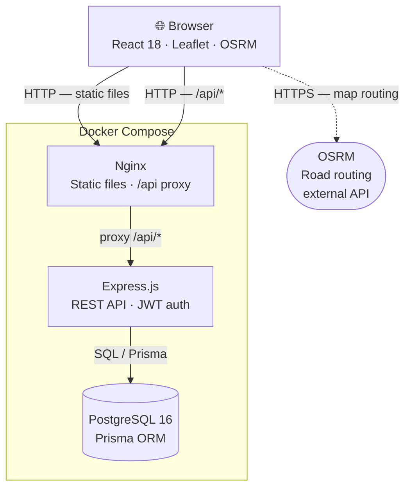
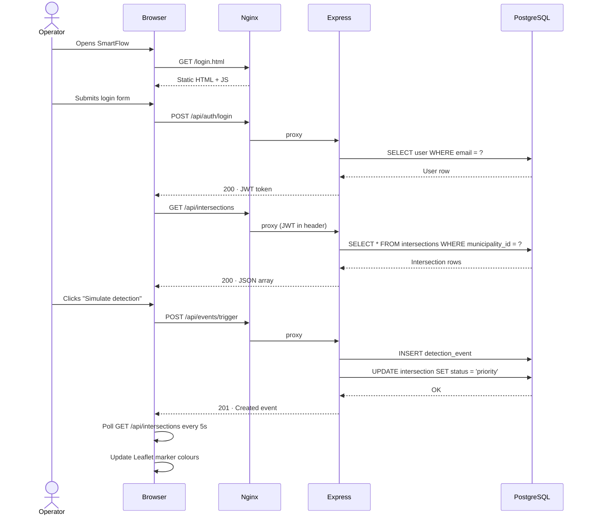

# Architecture — SmartFlow

> **Project II · Web Programming · ETIC_Algarve · 2025/26**

---

## System Architecture Diagram



---

## Data Flow



---

## Services

### `frontend` — Nginx (`nginx:alpine`)

Serves all static files — HTML, JSX, CSS, fonts — and acts as a **reverse proxy** for API requests. Because all traffic passes through Nginx on port 80, the browser always communicates with a single origin, eliminating CORS issues.

**Responsibilities:**
- Serve `index.html`, `simulator.html`, `styles.css`, `*.jsx`, `i18n.js`
- Proxy all `/api/*` requests to the `backend` service
- Fallback to `index.html` for client-side navigation

**Key config:** `frontend/nginx.conf`

---

### `backend` — Node.js 20 (`node:20-alpine`)

Express.js REST API. On startup it runs `prisma migrate deploy` to apply any pending migrations before the server begins accepting requests.

**Responsibilities:**
- Authentication: `POST /api/auth/login`, `POST /api/auth/logout`
- Municipality list: `GET /api/municipalities`
- Intersections CRUD: `GET|POST|PUT|DELETE /api/intersections`
- Detection events: `GET /api/events`, `POST /api/events/trigger`, `POST /api/events/:id/resolve`
- JWT validation middleware (guards all routes except auth)
- Structured logging for trigger and resolve operations

**Key files:** `backend/src/index.js`, `backend/src/routes/`, `backend/src/middleware/auth.js`

---

### `db` — PostgreSQL 16 (`postgres:16-alpine`)

Relational database. Data is persisted in a named Docker volume (`pgdata`) so it survives container restarts. A `pg_isready` healthcheck ensures the backend waits for the database before starting.

**Schema managed by:** Prisma (`backend/prisma/schema.prisma`)

---

### OSRM — External

The open-source routing engine used by the Leaflet map simulator to draw road-following ambulance routes. Calls are made directly from the browser to `router.project-osrm.org`.

> **Note:** OSRM is a public external service outside our control. If it is unavailable, the simulator falls back to a straight-line route. This dependency is explicitly noted as out-of-scope for reliability guarantees.

---

## Communication Patterns

| From | To | Protocol | Notes |
|------|----|----------|-------|
| Browser | Nginx | HTTP | Static file delivery + API gateway |
| Nginx | Express | HTTP | Reverse proxy for `/api/*` |
| Express | PostgreSQL | TCP / SQL | Via Prisma query engine |
| Browser | OSRM | HTTPS | External — map routing only |

---

## Containerisation

All services are orchestrated by a single `docker compose up --build` command. No manual setup is required beyond copying `.env.example` to `.env`.

```
docker compose up --build
```

| Service | Image | Port |
|---------|-------|------|
| frontend | nginx:alpine (custom) | 80 → 80 |
| backend | node:20-alpine (custom) | internal only |
| db | postgres:16-alpine | internal only |

The backend port is **not** exposed to the host. All external traffic enters through Nginx on port 80 only.

---

*SmartFlow · Group D · ETIC_Algarve · 2025/26*