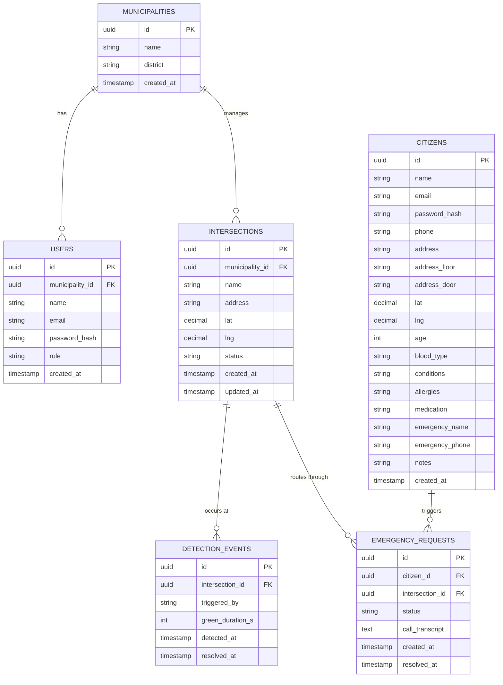

# Data Model — SmartFlow

> **Project II · Web Programming · ETIC_Algarve · 2025/26**

---

## Entity-Relationship Diagram

---

## Table Descriptions

### `municipalities`

A local authority (*câmara municipal*) that has joined the SmartFlow platform. This is the root tenant entity — every operator user and every intersection belongs to exactly one municipality. Municipalities are created by the SuperAdmin; no self-registration flow exists.

| Column | Type | Notes |
|--------|------|-------|
| `id` | UUID | Primary key, generated by Prisma |
| `name` | string (unique) | Display name, e.g. "Albufeira" |
| `district` | string | Portuguese district, e.g. "Faro" |
| `created_at` | timestamp | Creation date |

---

### `users`

Operators and administrators who log in to the dashboard. Each user belongs to exactly one municipality; their `municipality_id` is embedded in the JWT and used to scope every query automatically.

| Column | Type | Notes |
|--------|------|-------|
| `id` | UUID | Primary key |
| `municipality_id` | UUID FK | Owning municipality |
| `name` | string | Display name |
| `email` | string (unique) | Login identifier |
| `password_hash` | string | bcrypt hash (cost factor 10) |
| `role` | string | See roles table below |
| `created_at` | timestamp | |

**Roles**

| Value | Permissions |
|-------|-------------|
| `operator` | View dashboard and events log |
| `admin` | All operator permissions + create / edit / delete intersections, trigger and resolve detection events |
| `superadmin` | All admin permissions + manage all municipalities, approve or reject pending intersections, view cross-municipality event history |

---

### `intersections`

A physical road intersection monitored by SmartFlow. Each intersection belongs to one municipality and carries a live `status` field updated transactionally when detections are triggered or resolved.

| Column | Type | Notes |
|--------|------|-------|
| `id` | UUID | Primary key |
| `municipality_id` | UUID FK | Owning municipality |
| `name` | string | Human-readable label, e.g. "Av. da Liberdade / R. do Ouro" |
| `address` | string | Street address for display |
| `lat` | Decimal | WGS 84 latitude |
| `lng` | Decimal | WGS 84 longitude |
| `status` | string | See status table below |
| `created_at` | timestamp | |
| `updated_at` | timestamp | Updated on every status change |

**Status values**

| Value | Meaning |
|-------|---------|
| `pending` | Newly created — awaiting SuperAdmin approval before going live |
| `idle` | Normal traffic flow, no active priority event |
| `priority` | Emergency vehicle detected — green corridor active |
| `offline` | Camera or system fault, or rejected by SuperAdmin |

---

### `detection_events`

A record of each time an emergency vehicle priority was activated at an intersection, whether by camera, manual trigger, or citizen SOS.

| Column | Type | Notes |
|--------|------|-------|
| `id` | UUID | Primary key |
| `intersection_id` | UUID FK | Where the event occurred |
| `triggered_by` | string | See trigger sources below |
| `green_duration_s` | int | How long the green corridor was held open (seconds) |
| `detected_at` | timestamp | When the event was created |
| `resolved_at` | timestamp \| null | `NULL` while the event is still active |

**Trigger sources**

| Value | Description |
|-------|-------------|
| `camera` | Automatic detection by roadside camera hardware |
| `manual` | Triggered by an operator via the dashboard or API |
| `sos` | Triggered by a citizen pressing the SOS button |

---

### `citizens`

Members of the public who have registered for the SmartFlow citizen app. Citizens are completely separate from operator users — they have their own authentication flow (distinct JWT claim `type: "citizen"`) and no access to the operator dashboard.

| Column | Type | Notes |
|--------|------|-------|
| `id` | UUID | Primary key |
| `name` | string | Full name |
| `email` | string (unique) | Login identifier |
| `password_hash` | string | bcrypt hash |
| `phone` | string \| null | Contact number |
| `address` | string \| null | Street address |
| `address_floor` | string \| null | Floor number |
| `address_door` | string \| null | Door / apartment letter |
| `lat` | Decimal \| null | Location latitude |
| `lng` | Decimal \| null | Location longitude |
| `age` | int \| null | Used in simulated 112 transcript |
| `blood_type` | string \| null | e.g. "A+" |
| `conditions` | string \| null | Chronic conditions |
| `allergies` | string \| null | Known allergies |
| `medication` | string \| null | Current medication |
| `emergency_name` | string \| null | Emergency contact name |
| `emergency_phone` | string \| null | Emergency contact phone |
| `notes` | string \| null | Free-text notes for paramedics |
| `created_at` | timestamp | |

---

### `emergency_requests`

Created each time a citizen presses the SOS button. Records the simulated 112 call transcript and links the citizen to the intersection that was activated on their behalf.

| Column | Type | Notes |
|--------|------|-------|
| `id` | UUID | Primary key |
| `citizen_id` | UUID FK | The citizen who triggered the SOS |
| `intersection_id` | UUID FK \| null | The intersection set to `priority` (null if no idle intersection was available) |
| `status` | string | Always `"simulated_call"` in the current MVP |
| `call_transcript` | text \| null | Auto-generated Portuguese-language 112 script with the citizen's health data |
| `created_at` | timestamp | |
| `resolved_at` | timestamp \| null | Reserved for future use |

---

## Design Decisions

- **No vehicle registry.** Cameras detect the presence of an emergency vehicle by its lights — they do not identify individual vehicles. A `VEHICLES` table was explicitly excluded from the model.
- **Municipality scoping at the API layer.** There are no cross-municipality foreign keys. All filtering by municipality is enforced by JWT middleware in Express, not by database constraints, keeping the schema simple.
- **Soft status on intersections.** Rather than deriving `status` from the most recent `detection_event`, the field is stored directly on `intersections` and updated transactionally when an event is triggered or resolved. This allows instant reads without aggregation.
- **`resolved_at` as a nullable timestamp.** On both `detection_events` and `emergency_requests`, a `NULL` value means the record is currently active. This avoids a separate status enum and keeps queries simple.
- **Citizens as a separate auth domain.** Citizens do not belong to any municipality and use a distinct JWT claim (`type: "citizen"`). This separation prevents any accidental privilege escalation between citizen and operator endpoints.
- **Approval workflow for intersections.** New intersections start at `pending` status and require SuperAdmin approval before becoming `idle`. This ensures data quality in production without blocking municipalities from submitting new intersections.

---

*SmartFlow · Group D · ETIC_Algarve · 2025/26*
