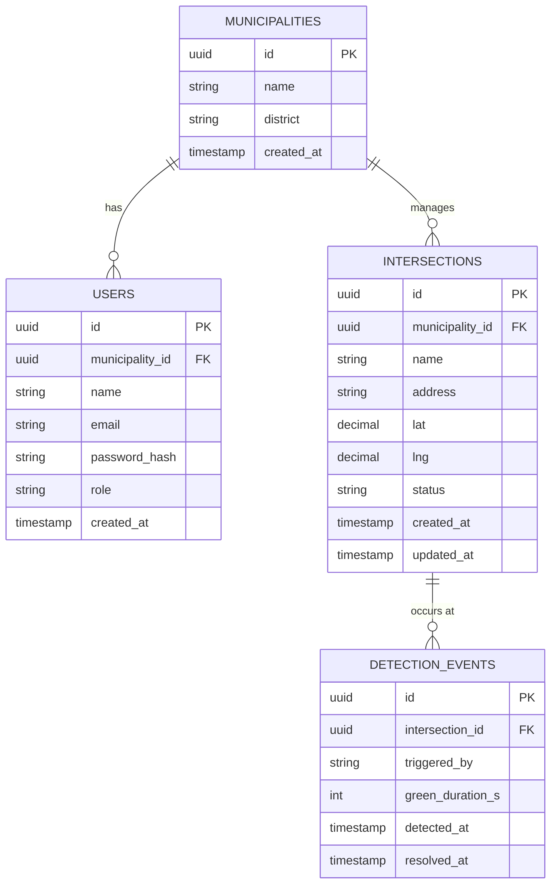

# Data Model — SmartFlow

> **Project II · Web Programming · ETIC_Algarve · 2025/26**

---

## Entity-Relationship Diagram

---

## Table Descriptions

### `municipalities`
Represents a local authority (câmara municipal) that has joined the SmartFlow platform. This is the root entity — every user and every intersection belongs to a municipality. The table is seeded with mock data for the MVP; no real sign-up flow exists at this stage.

### `users`
Operators and administrators who log in to the platform. Each user belongs to exactly one municipality; after login their `municipality_id` is embedded in the JWT and used to scope every subsequent query. Two roles exist:

| Role | Permissions |
|------|-------------|
| `operator` | View dashboard, view events log |
| `admin` | All operator permissions + add / edit / delete intersections, trigger manual detections |

### `intersections`
A physical road intersection monitored by SmartFlow. Each intersection belongs to one municipality and carries a live `status` field updated in real time when detections occur.

| Status | Meaning |
|--------|---------|
| `idle` | Normal traffic flow |
| `priority` | Emergency vehicle detected — green corridor active |
| `offline` | Camera or system fault |

### `detection_events`
A record of each time an emergency vehicle was detected at an intersection. The camera detects flashing lights and creates an event automatically; operators can also create events manually via the dashboard simulate button.

| Field | Notes |
|-------|-------|
| `triggered_by` | `"camera"` or `"manual"` |
| `green_duration_s` | How long the green corridor was held open (seconds) |
| `resolved_at` | `NULL` while the priority mode is still active; set when the intersection returns to `idle` |

---

## Design Decisions

- **No vehicle registry.** Cameras detect the presence of an emergency vehicle by its lights — they do not identify individual vehicles. The `VEHICLES` table was explicitly removed from the model.
- **Municipality scoping at the API layer.** There are no cross-municipality foreign keys. All filtering by municipality is enforced by JWT middleware in Express, not by database constraints.
- **Soft status on intersections.** Rather than deriving `status` from the latest `detection_event`, the field is stored directly on `intersections` and updated transactionally when a detection is triggered or resolved. This allows instant reads without aggregation.
- **`resolved_at` as a nullable timestamp.** A `NULL` value means the event is currently active. This avoids a separate `status` enum on the event itself and keeps queries simple.

---

*SmartFlow · Group D · ETIC_Algarve · 2025/26*